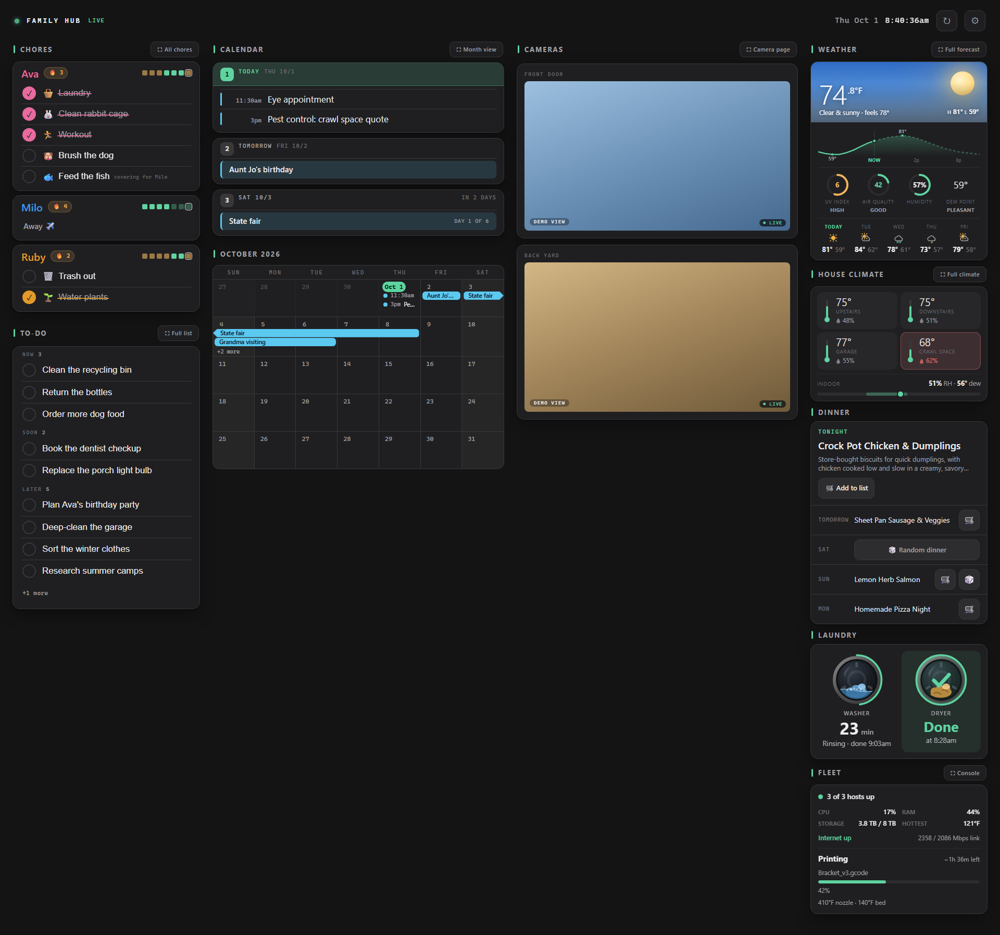
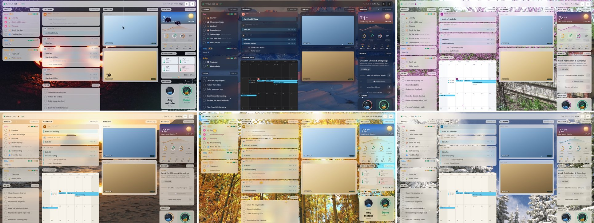
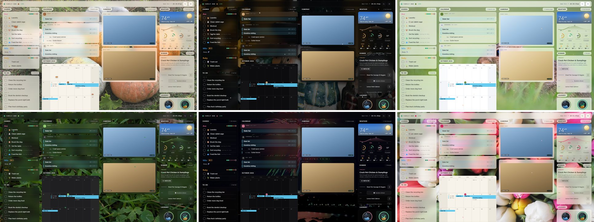

# family-hub

[](https://github.com/drench44/family-hub/actions/workflows/ci.yml)
[](https://github.com/drench44/family-hub/releases)
[](LICENSE)

A self-hosted **family wall display** built for a touchscreen on the kitchen
wall, with the same page mobile-optimized for phones. Google Calendar and
Apple/ICS calendars front and center, a per-person daily chore tracker with
one-tap check-off, live security-camera tiles (UniFi Protect, Wyze, anything
go2rtc speaks), at-a-glance weather and per-room climate cards that
expand to your full dashboards on a tap, and a laundry card that counts a
washer or dryer cycle down and remembers when the load finished, all in a
light or dark theme with an accent color you pick.



*The kitchen wall: one card system across chores with to-dos, the shared calendar over a month grid, cameras, at-a-glance weather + per-room climate, the laundry portholes, and the Fleet Console status card. Shown in the default grey theme with a green accent and sample data.*


*The same page, reflowed to six phone tabs, carrying the same theme. The Chores tab is shown here.*

Runs on any always-on Linux box with Docker. No cloud service of its own, no
accounts, no telemetry: it lives on your LAN and only talks out to the
calendars and services you connect. Point a wall screen (or any browser, or a phone)
at one URL.

## What it looks like

- **Wall (1920×1080):** chores + to-dos | calendar agenda + month grid | cameras |
  weather + climate + laundry + fleet, all in one card system. **Five display modes** (light, soft, blue,
  grey, black) **with a pick-your-accent color** (cyan, violet, amber, or green)
  and an optional subtle column
  separation, set from the wall itself or any phone and remembered per device.
- **Seasonal looks:** turn **Season** on in the gear menu and the wall follows
  the calendar: a real photograph fills the screen and the dashboard floats
  on it as frosted glass in your theme's colours, something gentle drifts at
  two depths (over the cards and softly behind them: leaves in fall, snow in
  winter, petals in spring, fireflies in summer), and a matching accent and a
  small mark sit beside the wordmark. **Winter** (Dec 1 to Feb 29) offers
  **Snowy Firs** (the default), **Alpenglow** and **Winter Cabin**; **Spring**
  (Mar 1 to May 31) offers **Redbud Bloom**, **Bluebonnet Hills** and a painted
  **Spring in France**; **Summer** (Jun 1 to Aug 31) offers **Sunflower
  Fields**, **Lone Ranch Sunset** and **Coastal Wildflowers**. Fall (Sep 1 to
  Nov 30) offers **Aspen Grove** (the default), **Misty Road** and **Maple
  Sky**, and **Halloween** takes October with **Lantern Night** (the
  default), **Witching Hour**, **Haunted Pines**, **Moonrise** and **Bare
  Branches** — bats cross the sky, a spider lets itself down on its thread,
  another lives on the glass, and webs hang in the corners. Ten holidays sit on
  top of those and win over the season they fall in: **New Year's** (Dec 27 to
  Jan 2, a slow gold sparkle), **Christmas** (Dec 1 to 26, snow), **Martin
  Luther King Jr. Day** (its long weekend), **Valentine's Day** (Feb 1 to 14,
  petals), **St Patrick's Day** (Mar 1 to 17, drifting clovers), **Easter**
  (the two weeks before it), **Mother's Day** and **Father's Day** (their
  weeks), the **Fourth of July** (Jun 25 to Jul 4) and **Thanksgiving** (the
  ten days before it, with the falling leaves), 29 looks in all. A device
  remembers one pick per season, so Thanksgiving week shows Thanksgiving's own
  default even if you picked a Fall look. Each look is
  picked per device under **All settings → Seasonal looks** from
  live preview tiles. Each of the five themes keeps its own glass: Light and
  Soft show the photo bright and airy, Blue, Grey and Black at dusk. Nothing
  moves at night or for reduced motion, and the art (public domain, CC0,
  CC-BY and MIT) ships inside the app. A slow screen such as a Raspberry Pi 3
  turns on **Lite** (All settings → Seasonal looks, per device, or add
  `?lite=1` to that screen's URL to latch it; `?lite=0` or the same Settings
  row turns it off again): the photo stays, but the glass becomes a plain card
  fill instead of a blur and the leaves, snow, petals, fireflies, bats and spiders never move.
  The Settings picker groups the seasons (in season now, coming up, more seasons).
  Adding a season or holiday follows [`docs/seasonal-looks.md`](docs/seasonal-looks.md).

  

  
- **Phone / tablet (≤1000px):** the same page reflows to bottom tabs —
  Chores / To-Dos / Calendar / Cameras / Weather / Laundry / Meals. On iPhone, open the
  hub in **Safari** and use Share → **Add to Home Screen** for a full-screen
  app with no browser toolbar (and no browser quirks); a normal browser tab
  also self-heals the occasional stuck-height reload on its own.
- **Calendar:** on the wall, a 3-day agenda with the current month's grid
  always showing under it (tap a day to open it in the full calendar). The
  agenda keeps the height it needs and the month grid grows into whatever
  screen height is left (the week rows get taller, never shorter than before,
  and never past about 140px a week); on the
  phone, the next-5-days home feed. Full-screen month grid + week agenda +
  day drill-in, tap-any-event detail cards, your own Google sidebar colors,
  multi-day events drawn as one bar across their span (Google-style), ended
  events struck through. A **+** button adds an event to any configured
  Google calendar straight from the overlay, showing up right away with no
  wait for the next sync.
- **Chores:** per-person cards in each person's color, streaks (🔥), a 7-day
  week strip, deterministic rotations, one-time chores due on a single date, a
  browsable day history, an away/pause mode so a trip never breaks a streak,
  and a one-shot confetti celebration when someone clears their day.
- **To-Dos:** one shared household list for the stuff that isn't a scheduled
  chore — anyone adds, anyone checks off. Grouped Now / Soon / Later, items
  carry over until done, a checked item stays struck-through for five minutes
  (tap it again to undo) and then moves to a 30-day "recently done" list that
  can restore it.
- **Weather & climate:** a glanceable weather card (temperature, a 24h
  temperature curve, UV index, air quality, humidity, dew point, and a 5-day
  high/low strip) and a per-room indoor climate card (temp + humidity, with a
  warn state when a room runs hot or a sensor goes stale). Tap **⛶ Full** on
  either to open your full weather or climate dashboard. Both fail soft: a dead
  feed quietly hides its card, never the wall. The weather feed's shape is
  documented in [`docs/weather-feed.md`](docs/weather-feed.md) (the 5-day strip
  needs a `dailyForecast` array on the feed and stays hidden without one).
- **Laundry:** washer + dryer as porthole cards fed by Home Assistant. The
  ring around each door shows how much of the cycle is left (against the
  machine's own cycle length when HA reports one, else a 60-minute dial),
  the drum tumbles while a cycle runs (wash water and suds in the washer, a
  heat glow in the dryer), and the words say what the machine is doing
  ("Sensing load", "Rinsing", "Cooling, almost done"). A finished load shows
  a check with *when* it finished, held for half an hour even after the
  machine shuts itself down. After that a finished **wash** turns amber and
  reads **Waiting** until the load is moved: the dryer starting, or the
  washer being turned on, ends it (a wet load can sit for hours; this
  household's median was about 100 minutes). It gives up after 12 hours,
  and then the card keeps a quiet "last load" line. Errors name the fault
  when the machine does ("won't drain", "load is unbalanced"), and a delayed
  start says when it will start. LG's placeholder "1 min left" at the start
  of a dryer cycle is caught and replaced with the real length. The card is
  real-time: a
  server-side watcher re-reads Home Assistant every 5 seconds for the whole
  cycle and pushes each change to open walls over a live stream
  (`GET /api/laundry/stream`, server-sent events), so a status change shows
  in seconds — machines that power themselves off right after the
  end-of-cycle chime can't slip through, and a finish that still lands
  between reads is reconstructed and shown as Done. Every observed phase
  transition is also logged in the database (`GET /api/laundry/log`, a year
  of cycle history, covered by the standard backups) so the finish
  heuristics can be tuned from real cycles — and because the server does
  the observing, the log fills even with no wall open. Built for LG
  ThinQ's sensors, but any HA integration exposing a status enum + a
  remaining-time timestamp works. Fails soft like weather/climate.
- **Meals (Mealie):** an optional "Dinner" card for a [Mealie](https://mealie.io)
  server: tonight's dinner with its photo and description, then one row per
  following day (up to a full week with `days: 7`; on the wall the list scrolls inside
  the card while tonight stays put). An **empty day** is a big **🎲 Random dinner** button. Each
  planned following day has a **⋮** menu (so a long recipe name keeps its row)
  with **🛒 Add to list**, which adds that recipe's ingredients to your shopping
  list, and, for a dinner the hub itself picked, **🎲 Re-roll** (it never
  replaces a dinner somebody planned by hand, and it draws again if it lands on
  the same recipe). Tonight's block keeps both as plain buttons. **⛶ Recipes** opens the native Recipes
  view (below). The card rides the panels column on the wall and has its own **Meals** tab on the
  phone. Needs a `mealie` config block and a `MEALIE_API_TOKEN` env var (below);
  off entirely without the block.
- **Recipes (Mealie):** the **⛶ Recipes** button on the Dinner card opens a full-screen,
  read-only view of your Mealie recipes, on the wall and the phone: a photo grid you can **search**
  (name, categories, tags; the on-screen keyboard on the wall), filter by **category chip**, and
  **sort** by A to Z (the default), recently added, recently made or top rated. Tap a recipe for its
  page: photo, prep/cook time, servings, ingredients (with section headings), numbered steps and
  notes. **Back** returns to the grid where you left it. Everything loads in one request and is
  filtered on the screen, so typing is instant even on a Raspberry Pi 3 (a small library of up to
  200 recipes; a note says so if there are more). It replaces the old Full screen embed of Mealie
  itself, which took 15-25 seconds to paint on a Pi 3, and stays open 15 minutes without a touch
  so you can cook from it. A recipe's **Plan it** button lists the days the Dinner card shows (with
  what is planned on each); tap one and the recipe becomes that day's dinner, replacing whatever was
  planned there, and the new dinner is not offered for Re-roll. Apart from that, recipes are read
  from Mealie, never written.
- **Shopping (Mealie):** the same Mealie server's shopping list as a native card in the
  wall's left column, under Chores beside the To-Do card (switch To-Dos off in Settings to
  give it the room), and a section on the phone's Meals tab. Tap an item's circle to
  check it off (tap again to un-check), type in the field at the top to **add** an item
  (on the wall the on-screen keyboard's Done adds it), and tap an item's name for an
  inline **Delete**. Unchecked items come first and the list scrolls inside the card
  (the add field stays put), so a long list never makes the column taller than the
  screen. It uses the `mealie` block's `shopping_list` (default: Mealie's first list) and
  the same `MEALIE_API_TOKEN`, rides the Meals (Mealie) switch, and every write first
  confirms the item is on that list. Quick add and delete are one tap on the wall, like
  the rest of it: the hub has no login.
- **Fleet Console:** an optional card proxying a separate home-lab dashboard's
  compact status rollup — a system-health line ("N of M hosts up", the worst
  problem in words when something's down) over a 3D printer's state, job,
  progress bar, ETA, and nozzle/bed temps. Rides the panels column under
  Laundry on the wall and the Weather tab on the phone (no tab of its own).
  Tap **⛶ Console** to open the full dashboard full-screen, when configured.
  Fails soft like weather/climate; off entirely with no `fleet` config block.
- **Manage:** tap **Edit** on the wall's Chores page to add/edit chores and
  people (rename, recolor, deactivate, or delete) right on the touchscreen —
  no phone needed. Mark someone **away** here too, with an optional backup to
  cover their chores, and tap **I'm back** when they return. The same page works
  from any browser on the LAN, so a phone or laptop manages everything too. No
  app to install.

## Architecture & trust model

**Dumb edge, smart box.** One FastAPI + SQLite container does everything; the
frontend is dependency-free vanilla JS baked into the image.

```
Wall / phones ─► http://<your-server>:8138/       family-hub (FastAPI + SQLite)
                          │ server-side sync/proxies
                          ├─► Google Calendar API   (reads polled every 5 min; the "+"
                          │                          button also writes new events)
                          ├─► any ICS/webcal feeds  (iCloud, school, holidays…)
                          ├─► iCloud CalDAV         (reminders + chore mirror, two-way, optional)
                          ├─► Home Assistant        (laundry, optional)
                          ├─► weather / climate / fleet feeds (tiles, optional)
                          ├─► go2rtc                (camera tiles, optional; proxied
                          │                          at /go2rtc/, never on the LAN)
                          └─► your own dashboards   (embedded panels, optional)
```

- **No auth, LAN-only — on purpose.** Anyone on your LAN can check off chores;
  that is the point of a family wall. Bind it to a LAN interface (`HUB_BIND`
  in `.env`) and never port-forward it. Away from home, reach it the way you'd
  reach any other LAN-only box: VPN into your home network first (WireGuard,
  Tailscale, or your router's built-in VPN all work), then open the same
  phone URL — that keeps the no-auth trust model intact instead of putting
  the hub on the open internet.
- **Fails soft.** The hub renders fine with zero cameras, zero panels, and no
  calendar configured; a dead upstream grays its tile with a quiet "offline";
  a dead calendar feed keeps showing its last-synced events.
- **Secrets never live in git.** OAuth tokens, camera URLs (Protect RTSPS
  URLs are per-camera capability tokens!), and Wyze credentials all live in
  the git-ignored `data/` directory on the box.
- **No microphones.** Every camera stream is video-only, enforced twice
  (`#media=video` on every go2rtc stream, `ENABLE_AUDIO=False` on the Wyze
  bridge). A family wall should never be a listening device.

## Quick start

```bash
git clone https://github.com/drench44/family-hub.git && cd family-hub
cp config.example.json config.json     # edit: your calendars/cameras/panels
cp .env.example .env                   # edit: your server's LAN IP + timezone
mkdir -p data && chmod 700 data
docker compose up -d --build web       # just the hub; cameras come later
curl -s http://<your-server>:8138/health   # {"status":"ok"}
```

Open the wall at `http://<your-server>:8138/`, tap **Edit** on the Chores card,
and add your people and chores — the wall comes alive. Everything below is
optional and independent — add the pieces you have.

> The frontend is **baked into the image**: after changing anything under
> `src/family_hub/web/static`, `docker compose build web` — a bare restart
> keeps the old files.

### Health: `/health` and `/health/full`

`/health` is liveness for the container healthcheck: the process answers and
can read `hub.db`. It stays `{"status":"ok"}` when an upstream is down, so an
outage never marks the container unhealthy.

`/health/full` answers "does the hub actually work?" and is what a deploy
should gate on. It always returns 200 with a report:

- `sources`: one entry per thing the wall shows (`calendar`, `laundry`,
  `weather`, `climate`, `fleet`, `cameras`), each with `ok`, a `status` word
  (`ok`, `off`, `waiting`, `stale`, `needs_auth`, `error`, `upstream_down`,
  `degraded`) and the timestamps that prove freshness. Only reads made by the
  running process count: the calendar's `last_sync` must be newer than
  `process_started_at`, and the laundry watcher's last good Home Assistant
  read must be under a minute old. Where the upstream stamps its own data
  (`wx.json` `ts`, the climate rooms' ages, the fleet rollup's
  `generatedAt`), that stamp is `data_ts` and must be recent too.
- `settings`: `HA_TOKEN` when laundry is configured, the Google token file
  when Google calendars are, and a laundry block that survived validation.
- `config`: the sha256 of `config.json` as loaded, as on disk now, and as the
  deploy recorded it (`matches_deploy`).
- `deploy`: what the deploy baked into `src/family_hub/build_info.json`
  (`engine_commit`, `overlay_commit`, `config_sha256`, `built_at`), or null
  for an image built by hand.
- `status` is `ok` only when nothing above failed; `problems` names each
  failure. `notes` (the backup heartbeat) is information only.

```bash
curl -s http://<your-server>:8138/health/full | jq '{status, problems}'
```

A deploy script can write `build_info.json` into the tree it builds from
(never commit it; it is git-ignored) to make `matches_deploy` and
`deploy.engine_commit` meaningful.

## Try the demo

Want to see the whole wall before wiring up anything? Run it with `DEMO=1` and
it comes up as a fully populated sample: a fake family (Ava, Milo, Ruby) with
chores, streaks and a week strip, a shared to-do list, a few calendar events,
canned weather and per-room climate cards, and placeholder camera tiles. No
config, no calendars, no cameras, no feeds needed. Nothing reaches the network.

Needs Python 3.12 and the runtime dependencies (a virtualenv is tidiest):

```bash
python3 -m venv .venv && source .venv/bin/activate
pip install -r requirements.txt

DEMO=1 DB_PATH="$(mktemp -d)/demo.db" CONFIG_PATH=config.demo.json \
  PYTHONPATH=src DISABLE_SYNC=1 \
  python3 -m uvicorn family_hub.app:app --port 8139
```

Then open `http://localhost:8139/`. Everything is fake sample data seeded on
first launch, so it's safe to poke at. (`docker compose` users can pass the
same `DEMO=1` in the `web` service's environment.)

## Put it on a wall (Raspberry Pi kiosk)

To mount the wall on a touchscreen, a Raspberry Pi makes a tidy appliance:
it boots straight into the dashboard, fullscreen, no browser chrome, no
cursor, and never sleeps. See **[docs/raspberry-pi-kiosk.md](docs/raspberry-pi-kiosk.md)**
for the full walkthrough, with copy-paste files in [`docs/kiosk/`](docs/kiosk/).

**No Pi required.** Any always-on browser works — a cheap **all-in-one
touchscreen PC** (or a touch monitor on a mini-PC) is a great no-fuss option:
one device, nothing to wire up, just open the dashboard fullscreen in its
browser.

**Typing on the wall.** A wall has no keyboard, so tapping a text field pops up
a built-in on-screen keyboard (letters, symbols, and emoji). It's for the wall
only — phones and laptops keep their own keyboard — so open the hub on the wall
once with **`?kiosk=1`** to turn it on (the setting is then remembered;
`?kiosk=0` clears it). See
**[docs/on-screen-keyboard.md](docs/on-screen-keyboard.md)**.

## config.json reference

| Key | What it is |
|---|---|
| `port` | Hub port (default 8138) |
| `calendars` | Calendar sources, in display order (see below) |
| `calendar_window_days` / `calendar_past_days` | Sync window forward / back (400 / 45 in the example config). The month view can page anywhere, but only days inside this window are actually fetched — outside it an empty day is marked "not synced" rather than shown as free. Raising it past 400 also needs `CAL_MAX_DAYS` in `app.py` raised, and the frontend's fixed fetch in `hub.js`. The reported window is additionally capped by what the last SUCCESSFUL sync actually covered, so an install that has never completed one — or whose source keeps failing — marks days as "not synced" even inside this configured window, rather than claiming days it never fetched. |
| `cameras` | go2rtc streams shown as tiles: `{"src","label"}` + optional `"hd"` (higher-res twin used full-screen) |
| `camera_page` | The phone/tablet **Cameras** tab as a 2×2 (row-major) live grid — same entry shape as `cameras`, but its own set and order, so the tab can show cameras the wall column doesn't. Omit to reuse `cameras`. |
| `panels` | Always-on dashboard embeds (see below) |
| `go2rtc_base` | Where the hub reaches go2rtc (`http://go2rtc:1984` in the compose stack; the `GO2RTC_FETCH_BASE` env var overrides it). Browsers never use it: they get the player through the hub. Omit if no cameras |
| `weather_base` | Base URL of a weather JSON feed for the native weather card (the card shows for a configured `weather` panel; empty base = "unavailable" note) |
| `climate_base` | Base URL of a per-room climate JSON feed for the native climate card (shows for a configured `climate` panel; empty base = "unavailable" note) |
| `laundry` | Washer/dryer status via Home Assistant: `{"ha_base", "machines": [{"id","label","kind","status_entity","remaining_entity"}]}` — `kind` is `washer` or `dryer` (sets the drum tint), the entities are HA sensor ids (LG ThinQ's *Current status* enum + *Remaining time* timestamp, or equivalents). Optional per machine: `total_entity` (cycle length in minutes; LG *Total time*), `start_entity` (LG *Delayed start* timestamp) and `error_entity` (LG *Error* event). Each only adds detail; leave any out. The HA long-lived token comes from the `HA_TOKEN` env var, never this file. Omit to skip the card. |
| `mealie` | Meals card: `{"base": "http://192.168.1.50:9000", "days": 5, "shopping_list": "Groceries", "open_url": "http://192.168.1.50:9000"}`. Only `base` is required (http/https; what the hub itself calls). `days` is how many days the card shows, today first (3-7, default 5). `shopping_list` is the list the 🛒 button adds to and the Shopping card shows, by name or id (default: Mealie's first list). `open_url` is still accepted (default: `base`) but nothing uses it now: the Dinner card's button opens the native Recipes view, not Mealie itself. The API token comes from the `MEALIE_API_TOKEN` env var, never this file. A malformed block is dropped with a warning in the log. Old configs may still carry a `panels` entry with id `mealie`: it is no longer embedded (the card replaces it) and is ignored. |
| `fleet` | Fleet Console card: `{"base": "http://192.168.1.50:3000"}` — the base URL of a separate home-lab dashboard app exposing a compact `/api/rollup` status endpoint (host + 3D-printer status). Optional `"label"`. Omit to skip the card. Pair with a `"fleet"` entry in `panels` (below) to get the **⛶ Console** full-screen button. |
| `theme` | House default display theme — `{"mode","accent","columns","layout","idleReturn","season"}` (`mode`: light/soft/dark/grey/black, `accent`: cyan/violet/amber/green, `columns`: none/wells/lines, `layout`: auto/desktop, `idleReturn`: on/off, `season`: on/off for seasonal looks). Applied on a fresh device with no saved override |

### Calendars: Google

Each entry: `{"id": "you@gmail.com", "label": "You", "color": "#5BC9F0"}`.
The `id` is the calendar's ID from Google Calendar settings (your address for
your primary calendar). One-time auth, from any desktop:

1. In the [Google Cloud console](https://console.cloud.google.com): create a
   project → enable the **Google Calendar API** → configure the OAuth consent
   screen (External, add yourself as a test user) → create an OAuth client of
   type **Desktop app** and download its JSON as `scripts/client_secret.json`.
   Leave the consent screen in Testing status — you're the only user, so
   there's nothing to gain from publishing it, and doing so requires a real
   verified domain for a privacy-policy link Google won't accept a free
   GitHub/GitHub Pages URL for. The one real tradeoff of staying in Testing:
   your refresh token expires roughly every 7 days, and you re-run step 2 to
   renew it. `needs_auth`/"reconnect" in Settings tells you when it's time —
   this is expected, not a failure.
2. `cd scripts && python3 google-auth.py` (needs
   `pip install google-auth-oauthlib`). Approve calendar read AND event-create
   access; it writes `token.json`.
3. Copy `token.json` into the box's `data/` directory. Done — the next 5-min
   sync picks it up. Your own sidebar colors and per-event colors carry over.

**Reconnecting from the wall instead of a desktop (optional).** If re-running
step 2 on a desktop every ~week is more friction than you want, `GOOGLE_OAUTH_
CLIENT_ID`/`_SECRET`/`_REDIRECT_URI` in `.env.example` set up a second,
web-flavored OAuth client that lets you tap "Reconnect Google Calendar" right
in Settings — approve on Google's page, `token.json` is written on the box,
no desktop involved. It needs the app to serve HTTPS (`TLS_CERT_FILE`/
`TLS_KEY_FILE`, also in `.env.example`), because Google rejects a redirect URI
that isn't either `localhost` or a real HTTPS hostname — a LAN or Tailscale
IP address doesn't qualify even over HTTPS. If you run Tailscale,
`tailscale cert <your-box>.<tailnet>.ts.net` gets you a real, trusted
certificate for free, scoped to your own tailnet, with no domain purchase or
Search Console verification needed. This is entirely optional — the plain
desktop-script path above always keeps working, with or without it.

### Calendars: Apple / iCloud / any ICS feed

Add `"kind": "ics"` and a `"url"` — no auth needed:

```json
{ "id": "school", "label": "School", "color": "#C39BEA",
  "kind": "ics", "url": "webcal://p123-caldav.icloud.com/published/2/…" }
```

For iCloud: Calendar app → right-click a calendar → Sharing → **Public
Calendar**, copy the `webcal://` link. Works equally for school calendars,
sports team feeds, national holidays — anything that publishes ICS.
Recurring events are fully expanded. A feed that goes dark keeps its
last-synced events on the wall instead of vanishing.

### Meals: a Mealie server

1. In Mealie, open your profile -> **API Tokens** and create one. It can plan
   meals and edit shopping lists, so treat it like a password.
2. Put it in the box's `.env` as `MEALIE_API_TOKEN=...` (it is in the compose
   `environment:` allowlist; a var missing from that list is invisible inside
   the container) and add the `mealie` block to `config.json` (reference above).
3. Check `/health/full`: its `meals` source and the `mealie_token` setting say
   whether the card can READ (it checks the plan read, not the writes: a token
   that can read but not edit shows a refusal toast on the first tap). A configured card with no token still shows on
   the wall, as "Meals needs a Mealie token", rather than vanishing.

The hub has no login, like the rest of the wall: anyone who can open it can plan
a random dinner or add to the shopping list. Re-roll is limited to dinners the
hub itself picked (remembered in its database), so a stray tap cannot replace
something you planned by hand. The photo comes through the hub
(`/api/mealie/image/<id>`), so a phone never needs a route to Mealie and nothing
sees the token.

### Panels: embed any dashboard you already run

Each panel renders a live page at a fixed virtual viewport and scales it to
fit its slot — so a dashboard designed for a big screen reads perfectly in a
column. Optionally crop to just the part you want:

```json
{ "id": "weather", "label": "Weather", "url": "http://192.168.1.50:8137/",
  "vw": 1024, "vh": 600, "full": "fit" }
```

| Field | Meaning |
|---|---|
| `vw`, `vh` | The visible region's design size (px) |
| `page_w` | Lay the page out wider than the visible region (for cropping) |
| `crop_top`, `crop_left` | Pan the visible region to a specific card |
| `full` | Full-screen mode: `"native"` (default; embeds the page raw) or `"fit"` (scales a fixed `vw`×`vh` sheet to fill the screen — for kiosk-style pages) |
| `full_url` | Different URL for full-screen (defaults to `url`) |

### Cameras

Camera tiles are live sub-second WebRTC streams via
[go2rtc](https://github.com/AlexxIT/go2rtc):

1. `cp go2rtc.yaml.example data/go2rtc.yaml` and fill in your streams —
   the example covers UniFi Protect (including the `rtspx://` fallback) and
   Wyze. Set `webrtc.candidates` to your server's LAN IP.
2. `docker compose up -d go2rtc`
3. Add each stream to `cameras` in config.json.

**go2rtc's API stays off your LAN.** It has no login, and it hands anyone who
asks every camera URL it knows (often a password or a per-camera token) and
lets them rewrite its config. So the compose file publishes only go2rtc's
WebRTC port (8555, video only) on the LAN. The hub serves the player itself at
`/go2rtc/` and passes the player's WebSocket through to go2rtc, for the
streams in your `cameras` / `camera_page` and nothing else. `data/go2rtc.yaml`
is mounted read-only: edit it on the server and `docker compose restart
go2rtc`. To use go2rtc's own web page for debugging, it is on the server's
loopback: `ssh -L 1984:127.0.0.1:1984 <server>`, then open
`http://127.0.0.1:1984/` on your computer.

On phones and tablets the **Cameras** tab shows a 2×2 live grid instead of the
wall's stacked column. It defaults to your `cameras`; set `camera_page` to give
that grid its own set and order (top-left, top-right, bottom-left, bottom-right)
— handy for surfacing a camera there that isn't on the wall.

> **Slow first picture? Check the camera's keyframe interval.** An H.264
> viewer can only start decoding at a keyframe, and go2rtc passes streams
> through without transcoding — so every viewer that joins an
> already-running stream (the wall keeps tile streams running 24/7) waits
> up to one full keyframe interval showing black. UniFi Protect defaults
> every channel to a **5-second** interval (`idrInterval: 5`), which reads
> as "the cameras take forever to load." Protect's UI doesn't expose the
> setting, but its API does — drop the interval to 1s on the channel your
> tile embeds (the Medium channel here, which is not the recording stream,
> so recorded footage and storage are untouched):
>
> ```bash
> # cookie login; the x-csrf-token RESPONSE header authorizes the PATCH
> curl -sk -c /tmp/uos -D /tmp/hdrs -H 'Content-Type: application/json' \
>   -d '{"username":"USER","password":"PASS"}' https://CONSOLE/api/auth/login
> CSRF=$(grep -i '^x-csrf-token:' /tmp/hdrs | tr -d '\r' | cut -d' ' -f2)
> # camera ids: GET https://CONSOLE/proxy/protect/api/cameras
> curl -sk -b /tmp/uos -X PATCH -H 'Content-Type: application/json' \
>   -H "X-CSRF-Token: $CSRF" \
>   -d '{"channels":[{"id":1,"idrInterval":1}]}' \
>   https://CONSOLE/proxy/protect/api/cameras/CAMERA_ID
> ```
>
> The camera applies it live (no reboot). Wyze firmware keyframes every 2s
> with no exposed setting to change it — that's the floor for Wyze tiles.

**Wyze** cams have no native RTSP — the bundled `wyze-bridge` service bridges
them: put your Wyze email/password/API-key in `data/wyze.env`
(`WYZE_EMAIL=…`, `WYZE_PASSWORD=…`, `API_ID=…`, `API_KEY=…`; get an API key at
developer-api-console.wyze.com), `docker compose up -d wyze-bridge`, find each
camera's slug in the bridge WebUI, and reference it from `go2rtc.yaml`. The
WebUI has no login, so it is published on the server's loopback only: from
your computer, `ssh -L 5050:127.0.0.1:5050 <server>` and open
`http://127.0.0.1:5050/`. Remove the service from the compose file if you don't need it.

> **Wyze Cam v3/v4 on recent firmware (the IOTC_ER_TIMEOUT problem):** Wyze's
> 2025 firmware (v4 4.52.9+) disabled the local TUTK P2P protocol, so the
> once-standard `mrlt8/wyze-bridge` can no longer connect to these cameras —
> streams fail with `IOTC_ER_TIMEOUT` even though the Wyze app still plays
> them. The compose here uses the actively-maintained **IDisposable fork**,
> which auto-falls-back to Wyze's WebRTC backend (the path that still works),
> so these cameras stream again with no downgrade. Two gotchas: this fork
> slugs stream names with **underscores** (not the original's dashes) — copy
> the exact slug from the bridge WebUI; and WebRTC streams are **on-demand**
> (they connect when a viewer opens the tile). If one specific camera fails
> its WebRTC handshake while its neighbors work, it's usually that camera's
> cloud session — a full power-cycle (unplug 30s) or remove/re-add in the
> Wyze app clears it.

A camera that's offline shows an honest gray "offline" tile — the hub probes
each stream every 30s and never fakes a LIVE badge.

> **Blurry full-screen?** A camera full-screens the *same* stream its tile
> uses — there's no magic upscaler — so a tile-resolution stream stretched to
> fill the wall looks soft. Give the camera a distinct higher-res twin: add a
> second go2rtc stream (`porch_hd`, `wyze_hd`) pointing at the camera's main /
> 4K channel and reference it as `"hd"` in that camera's `config.json` entry.
> The tile stays on the light stream; full-screen cross-fades up to the twin
> once it's live. One ceiling to know: a **Wyze v4 on recent firmware** runs
> the bridge's WebRTC fallback, and Wyze's cloud WebRTC path is capped at SD —
> for those cameras the main stream is already the sharpest source, so a twin
> won't help. Older Wyze models and UniFi Protect cams expose a real full-res
> channel that does.

## The chores model

**People** are nicknames with a color — the one expressive hue on the wall.
**A chore** has a schedule (`daily`, specific weekdays, or `once` — a one-time
chore due on a single date, then gone from the wall) and an assignment
(`fixed` to one person, or a `rotation`: an ordered list of people, repeats
allowed, assigned deterministically — `rotation_order[n mod len]` over the
chore's occurrence count, so there is no stored "whose turn" state to drift).
A one-time chore is always one person on that date.
Rotations skip deactivated people — their turns fall to the remaining members.
Completion is one tap; past days are read-only. **History is frozen:** each
served day's plan is recorded (the `occurrence_log` table), and past days
render from that record — so editing a schedule, reshuffling a rotation,
deactivating, or even deleting a chore changes today and the future only.
Nobody's streak is rewritten by an edit, and a deleted chore still shows on
the days it was actually done. Streaks count consecutive completed days (rest
days skip, an unfinished today is forgiven).
**Away / pause:** mark someone away for a stretch — open-ended, so you set it
when they leave and clear it when they're back — and those days read as rest,
so a trip never breaks their streak; on return they pick up where they left
off, whatever day it is. While away, a rotation turn falls to whoever's home,
and a fixed chore can pass to an optional **backup** who covers it (and gets
the credit). Away is a pure overlay on top of the frozen history — it never
rewrites a recorded day, so clearing an away period restores exactly what was
there, and you can even back-date one to repair a streak after the fact.
People and chores are managed
right on the wall's Chores page (tap **Edit**) — on the touchscreen or from any
browser on the LAN. Deleting
a person is history-safe: their frozen past days stay recorded, and they're
stripped from every chore's rotation or fixed assignment; **Deactivate** is the
reversible alternative.

## Backup

The SQLite DB (`data/hub.db`) is the only state that originates here —
everything else re-syncs. `backup/` contains a WAL-safe nightly snapshot
script + systemd units (fail-loud, atomic, keeps 14): edit the paths in the
`.service` file, then install script + units and
`systemctl enable --now family-hub-backup.timer`.
**Restore:** stop the container, copy a snapshot over `data/hub.db`, start.

## Adding a feature

Work through [`docs/adding-a-feature.md`](docs/adding-a-feature.md) as a
checklist — registry toggle, fail-soft backend, demo payload, mobile surface,
tests and guards, visual gates, docs + screenshot, review, and post-deploy
verification. Every item cites the real bug that created it; the wall ships
nothing that skipped a gate.

## Versioning & releases

The hub carries a real [SemVer](https://semver.org) in the root `VERSION` file,
and every change is recorded in [`CHANGELOG.md`](CHANGELOG.md)
([Keep a Changelog](https://keepachangelog.com) format) — that changelog and the
git tags / GitHub Releases are the "what's new". The running app exposes only a
small **debug readout**: `GET /api/version` returns `{version, build}`, and the
Settings overlay shows a quiet `family-hub v1.2.3` line so you can see what's
deployed without a shell. Nothing release-notes-y shows on the family wall.

Every code-changing PR adds a line under `## [Unreleased]`. This is enforced: a
CI check and a local `pre-commit` hook both block a `src/**` change that forgot
its changelog entry (docs-only and test-only diffs are exempt). Run
`scripts/install-hooks.sh` once to enable the local hook.

Cut a release with one command — it bumps `VERSION`, dates the changelog
section, stamps the static-asset cache-busts to the new version, commits, and
tags:

```bash
python scripts/release.py {major|minor|patch}   # then: git push --follow-tags
```

Pushing the `vX.Y.Z` tag triggers the `release` workflow, which publishes a
GitHub Release whose notes are that version's changelog section — so the
changelog is the single source for the release notes too. The asset `?v=`
cache-busts are unified to the app version, so one release busts every asset at
once (a test guards against any drift).

The release commit is the only commit that reaches `main` without a pull
request. Two shared checks from
[drench44/ci-policy](https://github.com/drench44/ci-policy) run here:
`pr-policy` on every PR (the body states which review band ran, a PR that says
it fixes a regression changes a test, and a size limit), and `main-watch` on
every push to `main`, which opens an issue labeled `main-watch` for any commit
that did not come through a merged PR with green checks. It needs every check
on the PR head green, waits (an hourly scheduled run re-checks, up to 3 hours)
for checks still running when the PR was merged, and marks each commit it
judges with a `ci-policy/main-watch` status that ci-policy's hosted audit
reads to notice a main-watch that never ran. Its allowlist accepts
exactly `release: vX.Y.Z` commits that touch only `VERSION`, `CHANGELOG.md` and
`src/family_hub/web/static/index.html`, which is what `release.py` writes.

## Tests

Four layers, no external services needed (Python 3.12):

```bash
pip install -r requirements.txt -c requirements.lock pytest   # pinned deps CI + the image use, + pytest
PYTHONPATH=src python3 -m pytest tests -q
```

Pure chore logic (rotation/streak math) · API (FastAPI + temp SQLite, all
upstreams mocked) · static frontend contracts (every referenced class styled,
no external resources, no hardcoded URLs) · executable JS helpers
(`node --test`, needs Node ≥ 20).

The JS layer runs via `tests/test_js.py`, which shells out to `node` (or a
Docker `node:20-alpine` fallback). If neither is present it **skips** — a skip
means the JS layer went unchecked, not that it passed, so install Node or Docker
to exercise it.

## License

MIT.

The seasonal look artwork credits (photographs in the public domain or CC0;
Twemoji and Noto Animated Emoji, CC-BY 4.0; Phosphor Icons and the Bug.js
spider, MIT) are in
[`src/family_hub/web/static/seasons/CREDITS.md`](src/family_hub/web/static/seasons/CREDITS.md).
